# Noeron: UX Flow Diagram

## System State Flow


## User Journey Flow

```mermaid
flowchart TD
    Start([User Opens App]) --> LoadEpisode[Load Podcast Episode]
    LoadEpisode --> PlayPodcast[Start Playing Podcast]
    
    PlayPodcast --> FeedBuilds{Feed Building}
    FeedBuilds -->|Timestamp reached| ShowInsight[Display New Insight Card]
    ShowInsight --> FeedBuilds
    
    FeedBuilds -->|User listening| ContinuePlay[Continue Playback]
    ContinuePlay --> FeedBuilds
    
    FeedBuilds -->|User curious| UserAction{User Action?}
    
    UserAction -->|Scrubs backward| RewindFeed[Filter Feed to Current Time]
    RewindFeed --> FeedBuilds
    
    UserAction -->|Scrubs forward| FastForwardFeed[Show Future Insights]
    FastForwardFeed --> FeedBuilds
    
    UserAction -->|Taps chat| PausePodcast1[Pause Podcast]
    PausePodcast1 --> OpenChat[Open Chat Interface]
    OpenChat --> TypeQuestion[User Types Question]
    TypeQuestion --> GeminiChat[Gemini Responds]
    GeminiChat --> ChatDecision{What Next?}
    ChatDecision -->|Satisfied| ResumePodcast1[Resume Podcast]
    ChatDecision -->|Wants more| OfferDive[Show "Dive Deeper" Option]
    OfferDive --> EnterExploration
    
    UserAction -->|Taps "Dive Deeper"| PausePodcast2[Pause Podcast]
    PausePodcast2 --> EnterExploration[Transition to Exploration Screen]
    
    EnterExploration --> ShowAnchor[Display Anchor Claim]
    ShowAnchor --> DefaultDepth[Show ELI5 Synthesis]
    
    DefaultDepth --> ExploreOptions{User Explores}
    
    ExploreOptions -->|More Technical| LoadTechnical[Load Technical Level]
    LoadTechnical --> ExploreOptions
    
    ExploreOptions -->|Show Data| LoadData[Load Data Level]
    LoadData --> ExploreOptions
    
    ExploreOptions -->|Concept Card| ExpandCard[Open Concept Card]
    ExpandCard --> CardDecision{Dive into Concept?}
    CardDecision -->|Yes| NewExploration[Start New Exploration Context]
    NewExploration --> ShowAnchor
    CardDecision -->|No| ExploreOptions
    
    ExploreOptions -->|Evidence Thread| FollowThread[Navigate Evidence Thread]
    FollowThread --> ThreadDecision{Continue Thread?}
    ThreadDecision -->|Yes| NewExploration
    ThreadDecision -->|No| ExploreOptions
    
    ExploreOptions -->|Guided Prompt| PromptResponse[Gemini Responds to Prompt]
    PromptResponse --> PromptDecision{Explore Further?}
    PromptDecision -->|Yes| NewExploration
    PromptDecision -->|No| ExploreOptions
    
    ExploreOptions -->|View Paper| OpenPaper[Open Paper Viewer]
    OpenPaper --> ReadPaper[User Reads Source]
    ReadPaper --> PaperDone{Done Reading?}
    PaperDone -->|Back| ExploreOptions
    
    ExploreOptions -->|Back to Podcast| TrackExploration[Mark Insight as Explored]
    TrackExploration --> ReturnToFeed[Return to Screen 1]
    ReturnToFeed --> ResumePodcast2[Resume from Saved Position]
    ResumePodcast2 --> FeedBuilds
    
    ResumePodcast1 --> FeedBuilds
    
    FeedBuilds -->|Episode ends| EpisodeComplete[Show Episode Complete]
    EpisodeComplete --> OfferNext[Suggest Related Episodes]
    OfferNext --> End([End Session])
    
    style Start fill:#e1f5ff
    style End fill:#ffe1e1
    style EnterExploration fill:#fff9e1
    style TrackExploration fill:#e1ffe1
    style PausePodcast1 fill:#ffe1f5
    style PausePodcast2 fill:#ffe1f5
```

## Detailed Interaction Flow: Dive Deeper


## State Transition Matrix


## Timestamp Synchronization Logic

```mermaid
flowchart TD
    Start([Podcast Playback]) --> CheckTime{Every 100ms}
    
    CheckTime --> GetCurrentTime[Get Current Timestamp]
    GetCurrentTime --> QueryInsights[Query Insights for Current Time]
    
    QueryInsights --> FilterInsights{Filter Logic}
    
    FilterInsights -->|timestamp <= current| ShowInsight[Show in Feed]
    FilterInsights -->|timestamp > current| HideInsight[Hide/Gray Out]
    
    ShowInsight --> CheckExplored{Explored?}
    CheckExplored -->|Yes| MarkExplored[Show ✓ indicator]
    CheckExplored -->|No| MarkUnexplored[Normal state]
    
    MarkExplored --> CheckTime
    MarkUnexplored --> CheckTime
    HideInsight --> CheckTime
    
    CheckTime -->|User scrubs| HandleScrub[Update Display]
    HandleScrub --> GetCurrentTime
    
    style ShowInsight fill:#90EE90
    style HideInsight fill:#FFE4B5
    style MarkExplored fill:#87CEEB
```



## Exploration Depth Navigation


## Data Flow Architecture


## Error Handling Flow

```mermaid
flowchart TD
    Action[User Action] --> Try{Try Operation}
    
    Try -->|Success| Success[Display Result]
    Success --> End([Continue])
    
    Try -->|Network Error| NetError[Show "Connection Issue"]
    NetError --> Retry{Retry?}
    Retry -->|Yes| Try
    Retry -->|No| Fallback1[Show Cached Content]
    Fallback1 --> End
    
    Try -->|API Timeout| Timeout[Show "Taking Longer Than Expected"]
    Timeout --> Wait[Wait with Progress]
    Wait --> Try
    
    Try -->|Rate Limit| RateLimit[Show "Please Wait"]
    RateLimit --> Backoff[Exponential Backoff]
    Backoff --> Try
    
    Try -->|No Results| NoResults[Show "No Relevant Papers Found"]
    NoResults --> Suggest[Suggest Alternative Queries]
    Suggest --> End
    
    Try -->|Critical Error| Critical[Log Error]
    Critical --> Fallback2[Show Graceful Degradation]
    Fallback2 --> End
    
    style Success fill:#90EE90
    style NetError fill:#FFB6C1
    style Critical fill:#FF6347
```

---

## Key Decision Points

### When to Pause Podcast


### When to Generate vs Retrieve Content


---

**End of Flow Diagram Documentation**