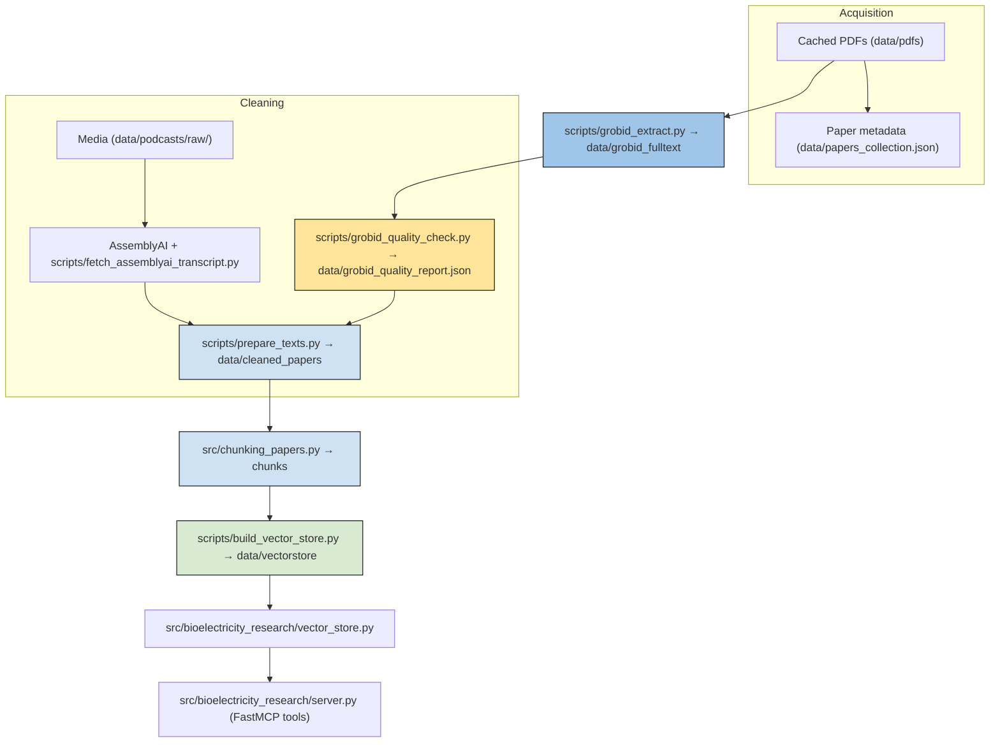

# Pipeline Overview

This project pipelines downloaded and transcripted material into a semantic corpus that feeds both the FastMCP-powered tools and any Claude/Gemini assistants. Every stage reads or writes under `data/`, and the visualization at the bottom shows how the artifacts flow from raw PDFs/audio to the vector store and MCP server.

## 1. Paper ingestion & PDF cache

`src/bioelectricity_research/storage.PaperStorage` drives the first stage. When you invoke `save_paper`/`save_author_papers` (via `uv run bioelectricity-research` or the FastMCP console), the storage layer:

- looks up metadata through Semantic Scholar and stores it in `data/papers_collection.json`
- downloads open-access PDFs into `data/pdfs`, reusing cached bytes on subsequent runs
- extracts full text with `pypdf` when PDFs are available
- falls back to ArXiv when Semantic Scholar returns an `ArXiv` ID
- runs `PDFParser.detect_sections` to keep introduction/methods/results/discussion/conclusion segments alongside the raw text

Those cached PDFs are the inputs for the downstream GROBID/extraction pipeline.

## 2. GROBID extraction & quality control

`python scripts/grobid_extract.py` posts every cached PDF to a running GROBID service (`http://localhost:8070/api/processFulltextDocument` by default). The resulting TEI is parsed, normalized, and written to `data/grobid_fulltext/<paper_id>.json`, which includes the original metadata, extracted sections, and the raw TEI blob for debugging.

Follow up with `python scripts/grobid_quality_check.py` to audit the transformed JSON:

- ensures titles/authors/abstracts were captured
- checks for empty sections or text that is suspiciously short compared to the PDF page count
- writes `data/grobid_quality_report.json` so you can focus on reprocessing the flagged papers

Both scripts accept `--input-dir`, `--output-dir`, and `--force` flags for partial runs.

## 3. Cleaned corpus & transcripts

`python scripts/prepare_texts.py` normalizes each file in `data/grobid_fulltext/`, collapsing whitespace, fixing hyphenation, and guaranteeing section headings have separators. Cleaned documents are written as individual JSON files in `data/cleaned_papers/` with tidy `full_text`, structured `sections`, and preserved `source_path`.

Interview transcripts (e.g., Lex Fridman #325 with Michael Levin) enter the pipeline via AssemblyAI. `scripts/fetch_assemblyai_transcript.py` uses `scripts/transcript_helpers.py` to:

- download or reuse audio/video via `yt-dlp`, storing the source under `data/podcasts/raw/`
- optionally transcode to MP3 with `ffmpeg`
- upload to AssemblyAI with speaker diarization enabled (set `ASSEMBLYAI_API_KEY` in your environment)
- identify Michael Levin’s speaker label, stitch his blocks into timestamped sections, and emit cleaned JSON into `data/cleaned_papers/`

Transcripts therefore appear alongside cleaned GROBID papers and participate in every downstream chunking/embedding step.

## 4. Chunking & the embedding store

`src/chunking_papers.PaperChunker` builds the vector-ready chunks:

- default chunk target is 400 tokens with a 50-token overlap, tokenized with `tiktoken.get_encoding("cl100k_base")`
- each chunk keeps `paper_id`, `paper_title`, `section_heading`, `chunk_index`, `token_count`, metadata (authors, year, source path), and an optional `page`
- chunks can be exported to JSON or NDJSON (`--export-path`, `--output-format`) for inspection

`scripts/build_vector_store.py` glues everything together:

1. optionally reruns `scripts.prepare_texts.py` to refresh `data/cleaned_papers/`
2. loads every cleaned paper (including AssemblyAI transcripts)
3. chunks them with the defaults above
4. clears the existing Chroma collection (`VectorStore.clear_collection()`)
5. embeds batches of text with `SentenceTransformer("sentence-transformers/all-MiniLM-L6-v2")`
6. persists documents, embeddings, and metadata in `data/vectorstore` via `chromadb.PersistentClient`

The `VectorStore` wrapper (in `src/bioelectricity_research/vector_store.py`) exposes `add_chunks()`, `search()`, and `get_stats()`, and every chunk stores enough metadata to link back to the original paper, section, and source path.

## 5. MCP server + RAG UX

`src/bioelectricity_research/server.py` wires the storage layer and vector store into `fastmcp.FastMCP("bioelectricity-research")`. The MCP exposes:

- **Phase 1 search tools** (`bioelectricity_search_papers`, `bioelectricity_get_paper_details`, `bioelectricity_get_author_papers`)
- **Phase 1.5 storage tools** (`save_paper`, `save_author_papers`, `list_saved_papers`, `get_saved_paper`)
- **RAG helpers** (`rag_search`, `rag_stats`) that query the persistent `data/vectorstore` and print context-rich markdown (or JSON)

Launch the server with `python -m bioelectricity_research` or `uv run bioelectricity-research` and connect through Claude Desktop, FastMCP CLI, or any MCP-compatible client. Rebuild `data/vectorstore` whenever the corpus changes so the RAG tools can return fresh context.

## 6. Claim context cards

`python scripts/context_card_builder.py` converts transcript segments into Gemini-powered claims, logs the RAG search query for every claim, and persists both the claims collection and the supporting `rag_results` in `data/context_card_registry.json`. Each segment entry now stores `podcast_id`, `timestamp`, `window_id`, `transcript_text`, `research_queries`, and Gemini metadata so you can audit which model/prompt was used. A podcast-specific cache file (`cache/podcast_<podcast_id>_claims.json`) mirrors the same data for downstream tooling.

Use `--use-gemini` plus `--podcast-id`/`--episode-title` (and `--redo` when you want to refresh an existing segment) to exercise the Gemini/RAG flow. When you have a full `data/window_segments.json`, run `python scripts/run_context_card_builder_batch.py --podcast-id <id> --episode-title "<title>" --use-gemini --redo` to process every window sequentially, skipping empty windows and logging progress. The batch helper writes each window to a temporary JSON file before invoking `context_card_builder.py`, so you get the same logging, cache updates, and registry validations you expect from single-segment runs.

After completing the batch, run `python scripts/validate_context_card_registry.py` (optionally with `--podcast-id <id>`) to check for duplicate `timestamp|window_id` keys, malformed timestamps, missing required fields, or empty claim lists before you ingest the cards into the rest of the system.

## 7. Verification agent

`agents/verification_agent.py` wires a lightweight `VerificationAgent` into the pipeline so you can surface trusted matches and flag low-confidence ones before they reach a human reader. The agent:

- loads every JSON file from `data/cleaned_papers/`, normalizes `paper_id`/`year`, and builds an in-repo citation graph without reloading for every check
- reuses the `VectorStore` wrapper from `src/bioelectricity_research/vector_store.py` to query semantically similar papers
- checks temporal coherence (podcast date vs. paper year), corpus citations, and whether similar chunks cite the target paper
- aggregates those scores with 20/40/40 weights and exposes `flags` (`FUTURE_PAPER`, `STALE_REFERENCE`, `LOW_CONFIDENCE`, `NO_CITATION_SUPPORT`, `ISOLATED_MATCH`) plus a human-readable reasoning string

Add it after every RAG match:

```python
from bioelectricity_research.vector_store import VectorStore
from agents.verification_agent import VerificationAgent

vector_store = VectorStore()
verifier = VerificationAgent()
verification = verifier.verify_match(
    claim_data=claim,
    matched_paper_id=matched_id,
    vector_store=vector_store,
    context={"podcast_date": episode_date},
)
claim["rag_results"]["verification"] = verification
```

The verification results are serializable (JSON-friendly `details` and `flags`), use only local data, and have a suite of regression tests in `tests/test_verification_agent.py`.

## Quick commands

```
uv run bioelectricity-research
python scripts/grobid_extract.py --input-dir data/pdfs --output-dir data/grobid_fulltext
python scripts/grobid_quality_check.py --json-dir data/grobid_fulltext --pdf-dir data/pdfs
python scripts/prepare_texts.py --input-dir data/grobid_fulltext --output-dir data/cleaned_papers
python scripts/fetch_assemblyai_transcript.py --youtube-url <url> --paper-id my_transcript --title "My Interview" --output-dir data/cleaned_papers
python src/chunking_papers.py --papers-dir data/cleaned_papers --export-path data/chunks.ndjson
python scripts/build_vector_store.py
```

Adjust `--chunk-size`, `--overlap`, and `--output-format` on `src/chunking_papers.py`, and rerun `scripts/build_vector_store.py` after adding papers or transcripts.

## Pipeline diagram

